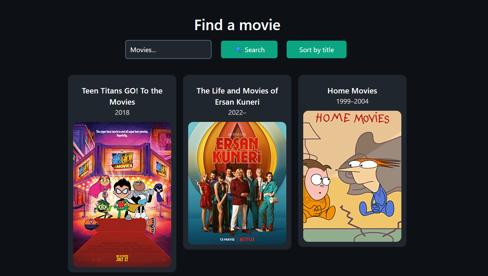

# Movie search

This project uses the [OMDb](https://www.omdbapi.com/) API to search for movies and get information about them. It's built with React and uses the water.css CSS framework for styling.



## API Reference

#### Get all items

```http
  GET http://www.omdbapi.com/?apikey=[yourkey]&s[query]
```

| Parameter | Type     | Description                |
| :-------- | :------- | :------------------------- |
| `api_key` | `string` | **Required**. Your API key |
| `s`       | `string` | **Required**. Query        |

## Installation

Install my-project with npm

- Clone the repository on your local machine.
- Install the dependencies with npm install.
- Run the application with npm run dev.
- Open the application in your web browser at http://127.0.0.1:5173/

## Environment Variables

To run this project, you will need to add the following environment variables to your .env file

`VITE_API_KEY`

`VITE_BASE_URL`

## Deployment

To deploy this project run

```bash
  npm run deploy
```

## Contributing

If you would like to contribute to this project, follow these steps:

- Fork the project.
- Create a new branch (git checkout -b feature/feature-name).
- Make the desired changes.
- Submit a pull request.

## Authors

- [stevenquintana](https://www.linkedin.com/in/stevenquintana/)

## License

This project is licensed under the MIT License. See the LICENSE file for more information.
